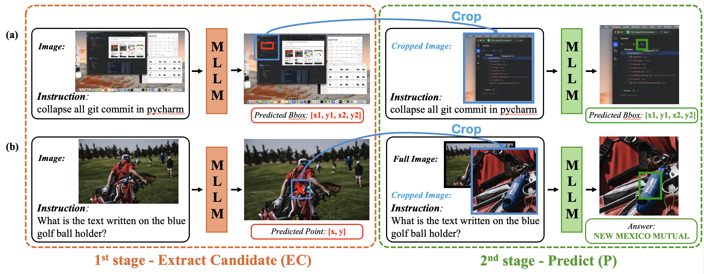

# A Training-Free, Task-Agnostic Framework for Enhancing MLLM Performance on High-Resolution Images
Jaeseong Lee*, Yeeun Choi*, Heechan Choi*, Hanjung Kim, Seon Joo Kim 

[CVPRW25] [**Emergent Visual Abilities and Limits of Foundation Models (EVAL-FoMo 2)**](https://sites.google.com/view/eval-fomo-2-cvpr/home?authuser=0) accepted!




## 🐳 Environment Setup (Docker)

To simplify deployment and ensure consistent environments, we recommend using the official **Qwen2.5-VL** Docker image.

> 📝 **Reference**: [Qwen2.5-VL GitHub Repository](https://github.com/QwenLM/Qwen2.5-VL)

### 📦 Launch the container

```bash
docker run --gpus all --ipc=host --network=host --rm --name qwen2.5 -it qwenllm/qwenvl:2.5-cu121 bash
```

This launches a container with all necessary dependencies pre-installed, based on Qwen2.5-VL's official setup.

---

## ⚡ Quick Start

### Step 1: Dataset Preparation

Clone this repo and download datasets as follows:

```bash
# Clone repository
git clone https://github.com/yeencye/ECP.git
```

#### 📂 GUI-grounding task
Inside `GUI-grounding/`, download the [ScreenSpot-Pro dataset](https://huggingface.co/datasets/likaixin/ScreenSpot-Pro)


#### 📂 MLLM-perception task
Inside `MLLM-perception/`, download the [HR-Bench dataset](https://huggingface.co/datasets/DreamMr/HR-Bench)

---

### Step 2: 1st-Stage EC (Extract Candidate)

Run the following script to generate candidate regions:

```bash
bash GUI-grounding/EC.sh
```

This will save cropped regions and intermediate JSONs under `./EC_output`.

---

### Step 3: 2nd-Stage P (Predict)

Run the following script to refine the bounding boxes using Qwen2.5VL or OS-Atlas:

```bash
bash GUI-grounding/P.sh
```

This will run inference on the cropped regions and save final prediction results under `./P_output`.

---
